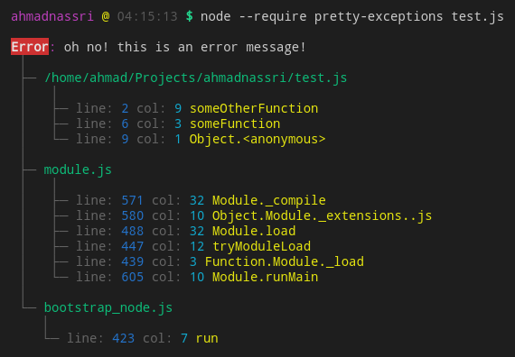

# Pretty Exceptions [![version][npm-version]][npm-url] [![License][license-image]][license-url]

[](https://greenkeeper.io/)

> Pretty and more helpful uncaught exceptions, automatically.

[![Downloads][npm-downloads]][npm-url]
[![Dependency Status][dependencyci-image]][dependencyci-url]
[![Dependencies][david-image]][david-url]



## Install

```bash
npm install --only=production --global pretty-exceptions
```

## Usage

```shell
$ node --require pretty-exceptions my-app.js
```

---
> :copyright: [ahmadnassri.com](https://www.ahmadnassri.com/) · 
> License: [ISC][license-url] · 
> Github: [@ahmadnassri](https://github.com/ahmadnassri) · 
> Twitter: [@ahmadnassri](https://twitter.com/ahmadnassri)

[license-url]: http://choosealicense.com/licenses/isc/
[license-image]: https://img.shields.io/github/license/ahmadnassri/pretty-exceptions.svg?style=flat-square

[npm-url]: https://www.npmjs.com/package/pretty-exceptions
[npm-version]: https://img.shields.io/npm/v/pretty-exceptions.svg?style=flat-square
[npm-downloads]: https://img.shields.io/npm/dm/pretty-exceptions.svg?style=flat-square

[david-url]: https://david-dm.org/ahmadnassri/pretty-exceptions
[david-image]: https://img.shields.io/david/ahmadnassri/pretty-exceptions.svg?style=flat-square

[dependencyci-url]: https://dependencyci.com/github/ahmadnassri/pretty-exceptions
[dependencyci-image]: https://dependencyci.com/github/ahmadnassri/pretty-exceptions/badge?style=flat-square
