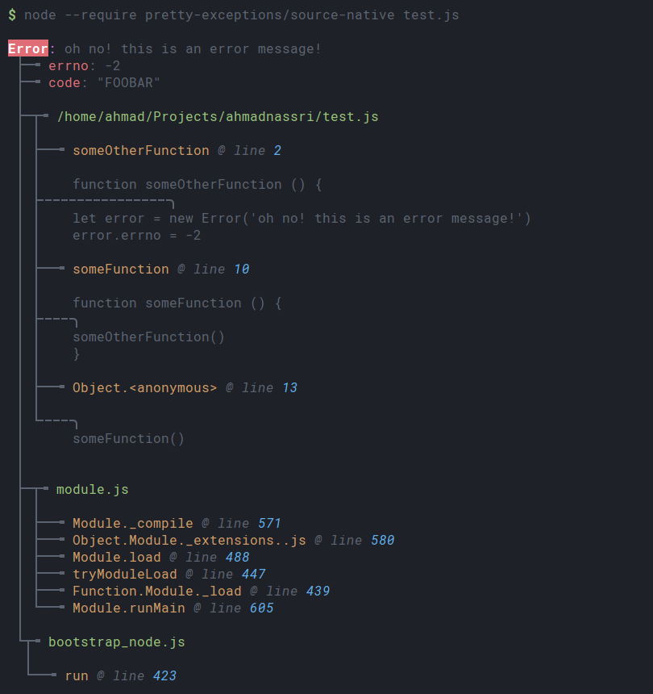
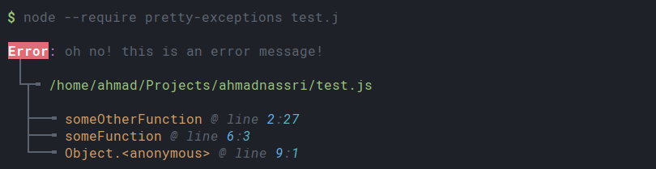
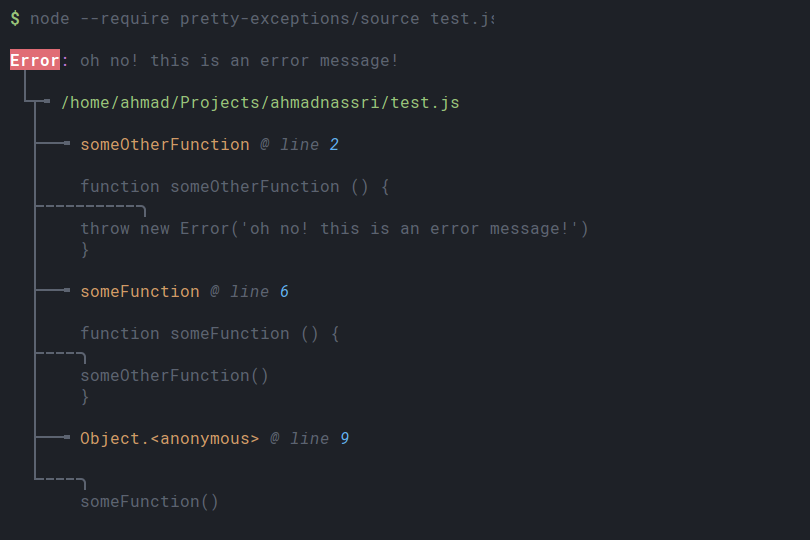
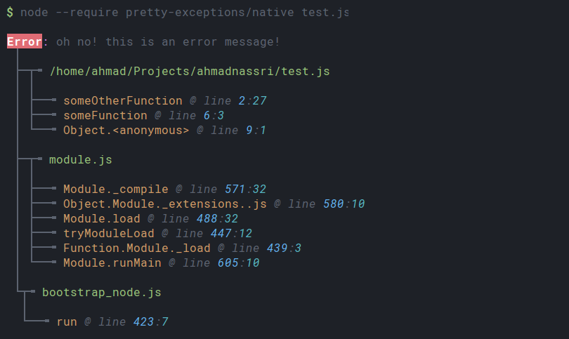
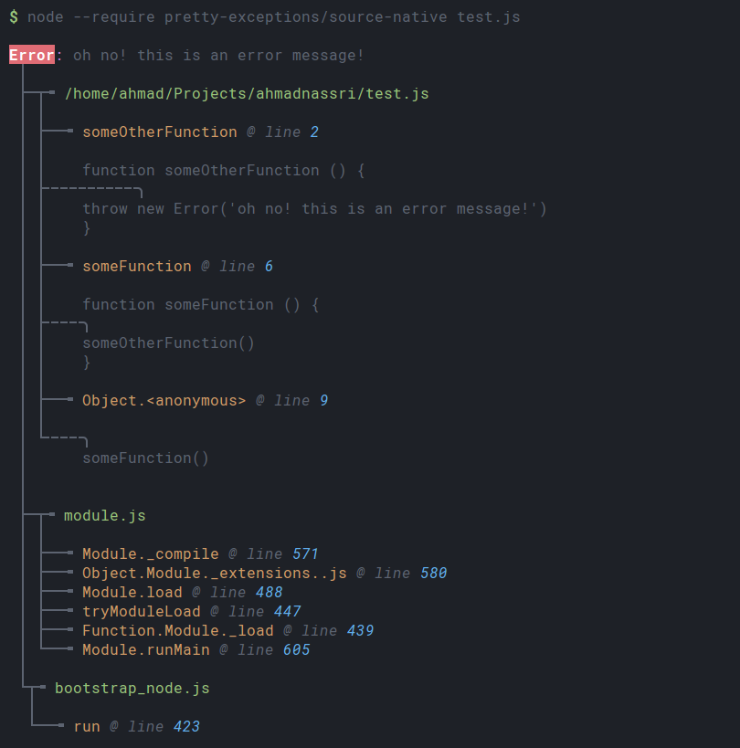

# Pretty Exceptions [![version][npm-version]][npm-url] [![License][license-image]][license-url]

> Pretty and more helpful uncaught exceptions, automatically.

[![Downloads][npm-downloads]][npm-url]
[![Dependency Status][dependencyci-image]][dependencyci-url]
[![Dependencies][david-image]][david-url]



## Usage

### CLI _(preferred)_

This is the preferred approach to best avoid mistakingly including into production builds

1. setup your [`NODE_PATH`][node-path] environment variable

```shell
export NODE_PATH="$NODE_PATH:$(npm root -g)"
```

2. install `pretty-exceptions`

```shell
npm install --production --global pretty-exceptions
```

3. run your application with the [`--require`][node-require] flag:

```shell
node --require pretty-exceptions my-app.js

# alternative modes (see below):
node --require pretty-exceptions/source my-app.js
```

#### Pro Tip:

Use Bash Aliases for less typing

```shell
# make a special alias for debugging
alias node-ex='node --require pretty-exceptions'

# or even better:
alias node='node --require pretty-exceptions/source'
```

> To make this persistent, you need to add this into your `~/.bashrc` _(or `~/.bash_profile`)_.

### API _(if you really must!)_

Require at the top-most entry point of your app:

```js
require('pretty-exceptions')

// alternative modes (see below):
require('pretty-exceptions/source-native')
```

#### Environment Variables

env                        | default | description            
-------------------------- | ------- | -----------------------
`PRETTY_EXCEPTIONS_SOURCE` | `false` | enable Source View mode
`PRETTY_EXCEPTIONS_NATIVE` | `false` | enable Native View mode

## Modes

### Default

```shell
$ node --require pretty-exceptions my-app.js
```

###### Output

```
Error: oh no! this is an error message!
 │
 └┬╼ /path/to/my-app.js
  │
  ├──╼ someOtherFunction @ line 2:27
  ├──╼ someFunction @ line 6:3
  └──╼ Object.<anonymous> @ line 9:1
```

###### Demo

> Colors will vary based on your local terminal configuration



### View Source

```shell
$ node --require pretty-exceptions/source my-app.js
# OR
$ PRETTY_EXCEPTIONS_SOURCE=true node --require pretty-exceptions my-app.js
```

###### Output

```
Error: oh no! this is an error message!
 │
 └┬╼ /path/to/my-app.js
  │
  ├──╼ someOtherFunction @ line 2
  │
  │    function someOtherFunction () {
  ├╌╌╌╌╌╌╌╌╌╌╮
  │    throw new Error('oh no! this is an error message!')
  │    }
  │
  ├──╼ someFunction @ line 6
  │
  │    function someFunction () {
  ├╌╌╌╌╮
  │    someOtherFunction()
  │    }
  │
  ├──╼ Object.<anonymous> @ line 9
  │
  └╌╌╌╌╮
       someFunction()
```

###### Demo

> Colors will vary based on your local terminal configuration




### View Native Calls

```shell
$ node --require pretty-exceptions/native my-app.js
# OR
$ PRETTY_EXCEPTIONS_NATIVE=true node --require pretty-exceptions my-app.js
```

###### Output

```
Error: oh no! this is an error message!
 │
 ├─┬╼ /path/to/my-app.js
 │ │
 │ ├──╼ someOtherFunction @ line 2:27
 │ ├──╼ someFunction @ line 6:3
 │ └──╼ Object.<anonymous> @ line 9:1
 │
 ├─┬╼ module.js
 │ │
 │ ├──╼ Module._compile @ line 571:32
 │ ├──╼ Object.Module._extensions..js @ line 580:10
 │ ├──╼ Module.load @ line 488:32
 │ ├──╼ tryModuleLoad @ line 447:12
 │ ├──╼ Function.Module._load @ line 439:3
 │ └──╼ Module.runMain @ line 605:10
 │
 └┬╼ bootstrap_node.js
  │
  └──╼ run @ line 423:7
```

###### Demo

> Colors will vary based on your local terminal configuration



### View Source & Native

```shell
$ node --require pretty-exceptions/source-native my-app.js
# OR
$ PRETTY_EXCEPTIONS_SOURCE=true PRETTY_EXCEPTIONS_NATIVE=true node --require pretty-exceptions my-app.js
```

###### Output

```
Error: oh no! this is an error message!
 │
 ├─┬╼ /path/to/my-app.js
 │ │
 │ ├──╼ someOtherFunction @ line 2
 │ │
 │ │    function someOtherFunction () {
 │ ├╌╌╌╌╌╌╌╌╌╌╮
 │ │    throw new Error('oh no! this is an error message!')
 │ │    }
 │ │
 │ ├──╼ someFunction @ line 6
 │ │
 │ │    function someFunction () {
 │ ├╌╌╌╌╮
 │ │    someOtherFunction()
 │ │    }
 │ │
 │ ├──╼ Object.<anonymous> @ line 9
 │ │
 │ └╌╌╌╌╮
 │      someFunction()
 │ 
 │
 ├─┬╼ module.js
 │ │
 │ ├──╼ Module._compile @ line 571
 │ ├──╼ Object.Module._extensions..js @ line 580
 │ ├──╼ Module.load @ line 488
 │ ├──╼ tryModuleLoad @ line 447
 │ ├──╼ Function.Module._load @ line 439
 │ └──╼ Module.runMain @ line 605
 │
 └┬╼ bootstrap_node.js
  │
  └──╼ run @ line 423
```

###### Demo

> Colors will vary based on your local terminal configuration



---
> :copyright: [ahmadnassri.com](https://www.ahmadnassri.com/) · 
> License: [ISC][license-url] · 
> Github: [@ahmadnassri](https://github.com/ahmadnassri) · 
> Twitter: [@ahmadnassri](https://twitter.com/ahmadnassri)

[license-url]: http://choosealicense.com/licenses/isc/
[license-image]: https://img.shields.io/github/license/ahmadnassri/pretty-exceptions.svg?style=flat-square

[npm-url]: https://www.npmjs.com/package/pretty-exceptions
[npm-version]: https://img.shields.io/npm/v/pretty-exceptions.svg?style=flat-square
[npm-downloads]: https://img.shields.io/npm/dm/pretty-exceptions.svg?style=flat-square

[david-url]: https://david-dm.org/ahmadnassri/pretty-exceptions
[david-image]: https://img.shields.io/david/ahmadnassri/pretty-exceptions.svg?style=flat-square

[dependencyci-url]: https://dependencyci.com/github/ahmadnassri/pretty-exceptions
[dependencyci-image]: https://dependencyci.com/github/ahmadnassri/pretty-exceptions/badge?style=flat-square

[node-path]: https://nodejs.org/docs/latest/api/modules.html#modules_loading_from_the_global_folders
[node-require]: https://nodejs.org/api/cli.html#cli_r_require_module
